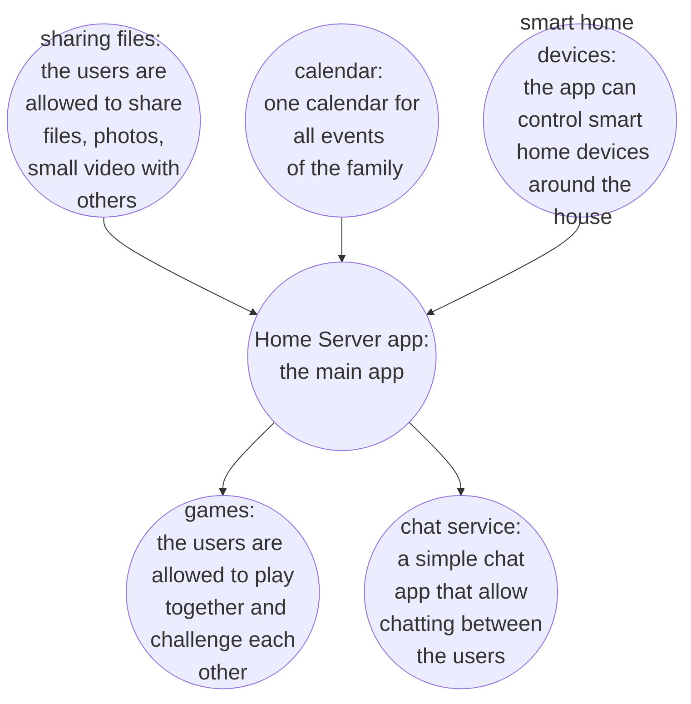

# [project name]

# team members

- Abdullah
- Mayadah

# goals

1. create a server and a frond end app that can be self-hosted in a home network
2. allow chatting between people in the server
3. control smart home devices
4. share files between people in the server
5. play games among people in the server
6. A family calendar that triggers all events for the families

# approach

| Features                   | Explanation                   |
| -------------------------- | ----------------------------- |
| chatting between members   | the system will use [service] |
| control smart home devices | all smart home devices ...    |
| share files                |                               |
| play games                 |                               |
| family calendar            |                               |

# Technical challenges:

1. Security
2. Storage
3. efficiency
4. Responsiveness
5. learning new languages and tool
6. working on a full stack project with only two members in the team

# Milestones

## Milestone 1

- create the planning document
- compare and select technical tools
  - **front end**
    - plain html_css_js vs react js vs vue js
  - **backend**
    - php laravel vs .NET vs flask vs express js
  - **database**
    - sql (sqlite, mysql ... etc) vs nosql (mongoDB ...)
- create a small demo "hello world" to evaluate the tools
- resolve technical challenges
- Create requirement document
- create design plan

## Milestone 2

- review plan, requirements, test, and design documents
- a shell script to run both the frontend and backend
- create test plan

## Milestone 3

## Milestone 4

- build and deploy the app
